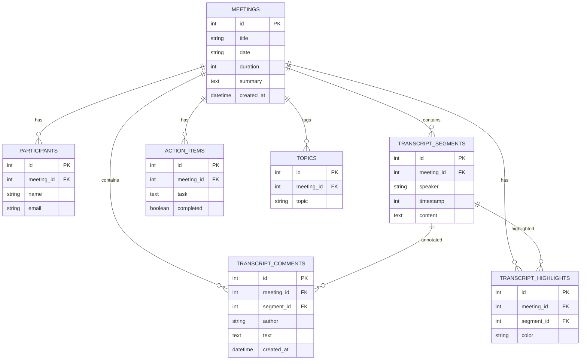

# Fireflies.ai Clone Workspace

This is a production-grade, highly polished workspace application replicating the visual layout, UX features, interactive transcription engine, and AI-summarization workflows of Fireflies.ai.

```
.
├── backend/            # FastAPI + SQLite + SQLAlchemy
│   ├── database.py     # Database engine & session
│   ├── models.py       # SQLAlchemy ORM models
│   ├── schemas.py      # Pydantic serialization schemas
│   ├── crud.py         # DB helpers & transcript parser
│   ├── main.py         # REST Router
│   ├── seed.py         # DB initializer & audio generator
│   └── requirements.txt
└── frontend/           # Next.js 15+ + Tailwind + TanStack Query
    ├── public/         # Public static assets (including sample.wav)
    ├── src/
    │   ├── app/        # App router structure (Dashboard & Details)
    │   └── components/ # Sidebar, Navbar, AudioPlayer, TranscriptPanel, Dialogs
    └── package.json
```

## Features

- **Left Sidebar Navigation**: Seamless sidebar mimicking Fireflies library, search, settings, and dark/light toggling.
- **Spotlight Global Search**: Top navbar search bar with debounced API queries returning grouped results (Meetings, Transcripts, Action Items) with timestamp seek navigation.
- **Meetings Library Dashboard**: Displays title, date, duration, participants, and summary snippet. Supports sorting (Newest/Oldest), date picker filtering, and participant filtering.
- **Meeting Detail Layout**: Synced double-panel page with media player & scrolling transcripts on the left, and tabs (AI summary, Action checklist, Topic tags, Ask AI assistant) on the right.
- **Interactive Transcript & Audio Sync**: Click transcript paragraphs to seek the media player. Transcript auto-scrolls and highlights the speaking segment during audio playback.
- **Multi-color Transcript Highlighters & Inline Comments**: Annotate specific dialogue blocks with comments or highlight colors (yellow, blue, green, pink).
- **Interactive Tasks Checklist (CRUD)**: Action items can be added, toggled complete/todo, text-edited inline, and deleted.
- **RAG Simulator (Ask AI)**: Chat interface that answers questions about the call based on meeting notes.
- **Exporters**: Downloader for transcripts in Markdown, and summaries in text files.

---

## Database Schema



---

## Quick Setup Instructions

### 1. Run the Backend Server
Requires Python 3.10+.
```bash
cd backend

# Create virtual environment
python -m venv venv

# Activate virtual environment
# Windows (PowerShell):
.\venv\Scripts\Activate.ps1
# macOS/Linux:
source venv/bin/activate

# Install requirements
pip install -r requirements.txt

# Create DB & Seed 5 Realistic Meetings + Generate Sample Audio
python seed.py

# Start FastAPI server
uvicorn main:app --reload --port 8000
```
FastAPI server will be running on [http://localhost:8000](http://localhost:8000).

### 2. Run the Frontend Client
Requires Node.js 18+.
```bash
cd frontend

# Install packages
npm install

# Start development server
npm run dev
```
Client workspace will be available at [http://localhost:3000](http://localhost:3000).

---

## API Documentation

- `GET /api/meetings`: Fetch list of meetings. Query parameters:
  - `q`: search titles
  - `participant`: filter by participant name
  - `date`: filter by date (`YYYY-MM-DD`)
  - `sort`: `newest` or `oldest`
- `GET /api/meetings/{id}`: Fetch detailed meeting object including all transcript segments, action items, topics, and annotations.
- `POST /api/meetings`: Create a new meeting. Accept parsed structured fields or raw transcript text (auto-detects speakers & timestamps).
- `PUT /api/meetings/{id}`: Update meeting metadata.
- `DELETE /api/meetings/{id}`: Delete meeting.
- `GET /api/meetings/{id}/transcript`: Read transcript segments.
- `POST /api/meetings/{id}/comments`: Add inline comment to segment.
- `POST /api/meetings/{id}/highlights`: Toggle highlight on segment.
- `POST /api/action-items`: Add action item to meeting.
- `PUT /api/action-items/{id}`: Edit action item text or toggle complete status.
- `DELETE /api/action-items/{id}`: Delete action item.
- `GET /api/search?q={query}`: Global spotlight search.

---

## Deployment Instructions

### Frontend (Vercel)
1. Push workspace to GitHub.
2. Link project to Vercel.
3. Configure Environment Variables:
   - `NEXT_PUBLIC_API_URL`: URL of deployed FastAPI backend.
4. Deploy!

### Backend (Render/Railway/Fly.io)
1. Select Docker or Python environment.
2. Deployment command: `uvicorn main:app --host 0.0.0.0 --port $PORT`
3. If SQLite DB needs persistence, deploy on Railway with a persistent disk volume, or deploy a PostgreSQL server and swap the engine URI in `backend/database.py` to `postgresql://`.
